## Build

Clone into `Escape from Tarkov/Development/SPT.WeaponCamoAndStickers` 
`dotnet build ./Client` will compile all projects including Fika support 
`dotnet build ./Client/MaterialEditor` will skip Fika support 
add `-c Release` at the end to get optimized build 
Build artifacts are copied into `Escape from Tarkov/BepInEx/plugins/7Bpencil.WeaponCamoAndStickers` 

## APPLY PAINT

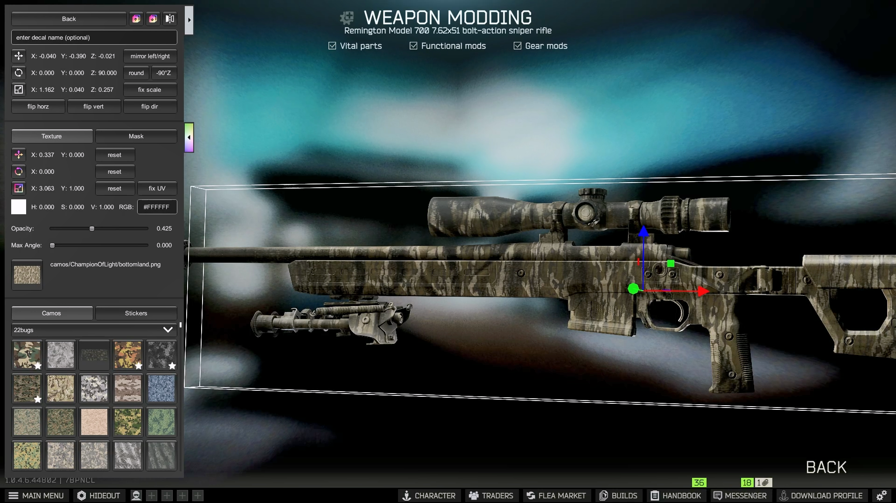
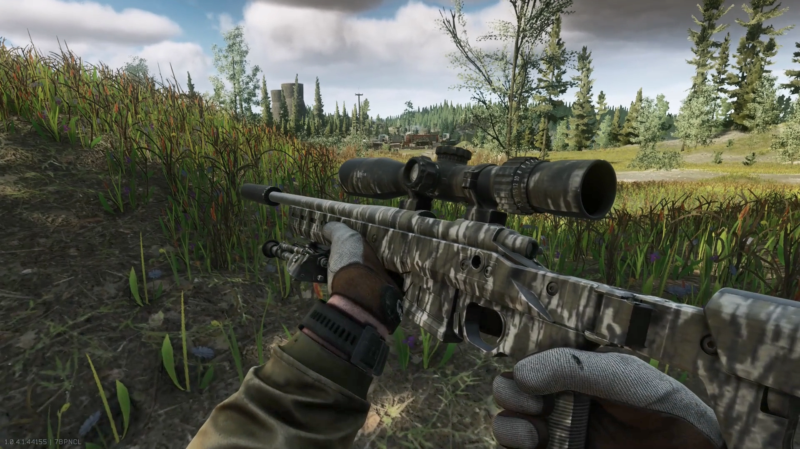
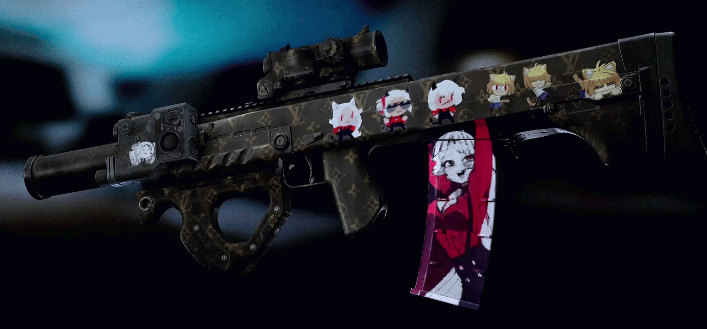
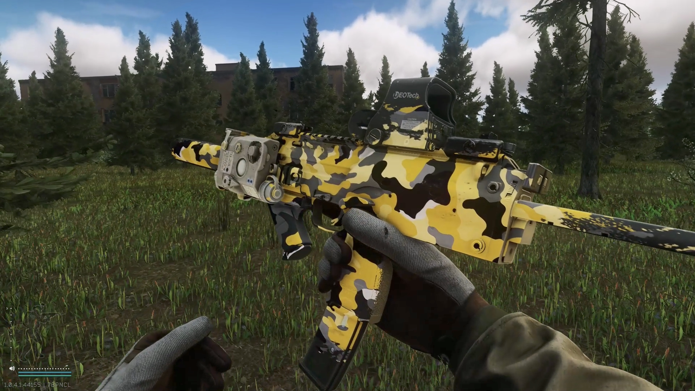

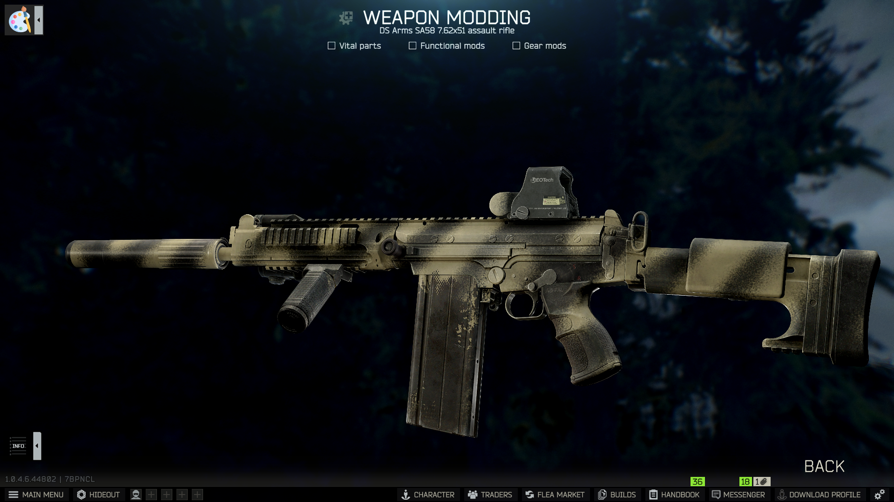
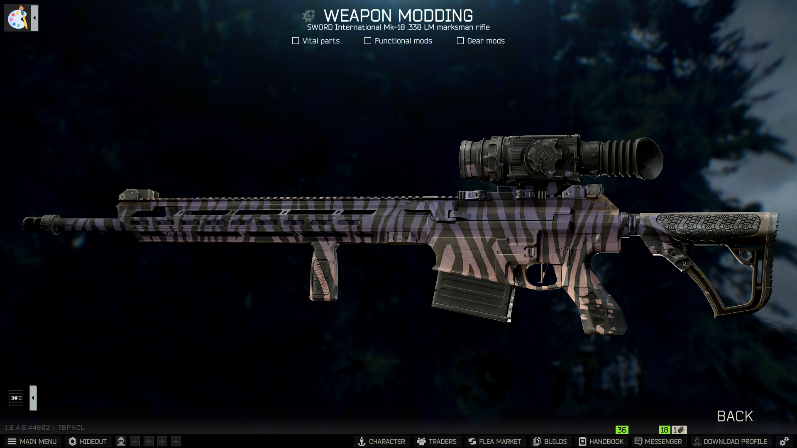

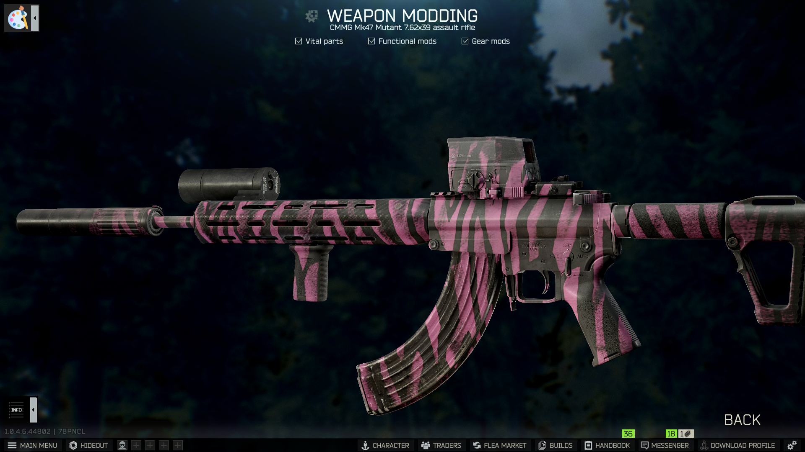
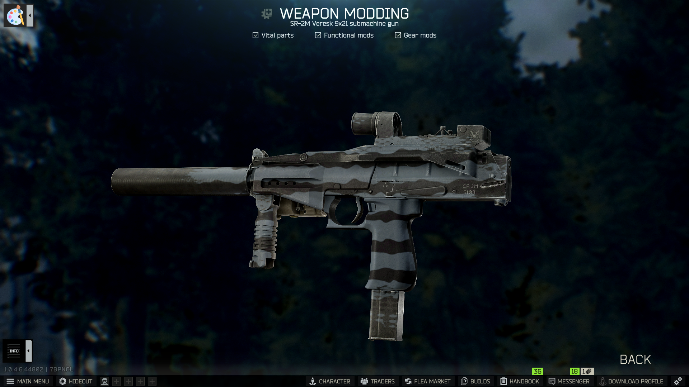
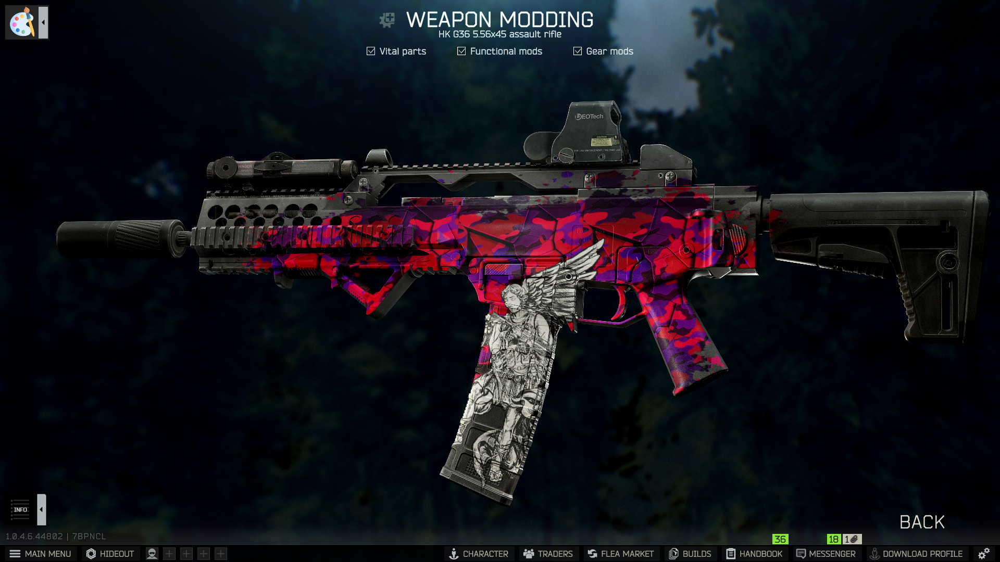

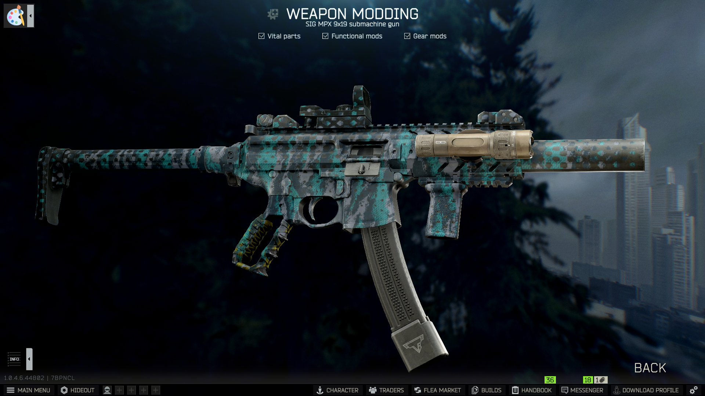
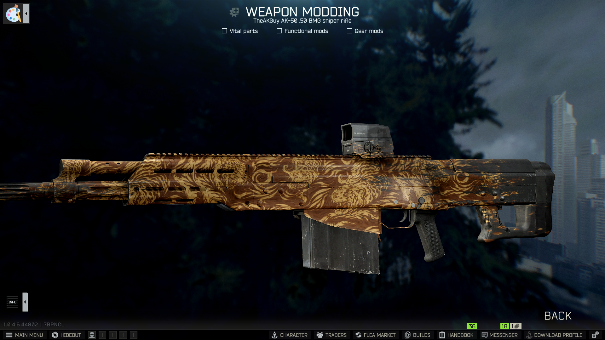
